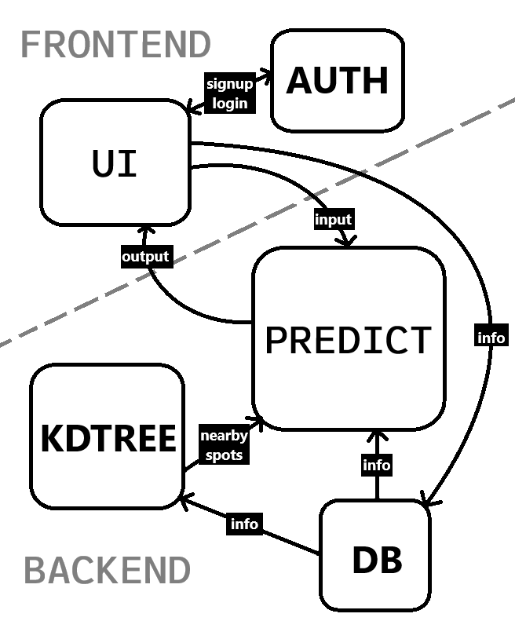

# Workflow

In this file we describe the idea, functionality, the design choices, the frameworks and tools used for the creation of `Parkathon`.

## Table of Contents
1. [Idea](#idea)
2. [Functionality](#functionality)
3. [Design](#design)
4. [Frameworks and Tools](#frameworks-and-tools)

## Idea

The main idea is to collect information about parking spots (parking events, timestamps, weather). This data is then mapped and stored in a database. The stored information can later be used to provide accurate parking spot suggestions. Essentially, `Parkathon` aims to enhance the searching experience of the user, transitioning from arbitrary to probabilistic searches.

## Functionality

### User Authentication
To use the app, the user is prompted to log in. Their credentials are handled securely using *hashing* for passwords and secure *tokens* for session cookies.

### Setting Destination
After logging in, the user sets their destination, triggering a call to the backend. The backend receives the user's position (latitude and longitude), timestamp, and weather information as input.

### Locating Nearby Spots
The app fetches information from the database and uses a **kd-tree** to locate available parking spots within a specified radius from the destination. 

Since it is unrealistic to assume the database always has up-to-date information about parking spot availability (as not all users use the app), the app makes additional calls to the database for each identified "available" spot. These calls gather any entries related to that specific spot.

### Prediction
The gathered data is then preprocessed, and new meaningful features are added. A Random Forest classifier with regression is trained on this data to predict the probability that a given parking spot is free, based on the time, weather, and other factors. The results are displayed to the user as color-coded pins on a map, with green indicating higher probabilities and red indicating lower probabilities.

### Updating Parking Status
Once the user reaches their destination and parks, they press the 'park' button, creating a new entry in the database. Similarly, when the user unparks their car, they update the database accordingly.

### Schematic

## Design

The UI is minimalistic and easy to use to enhance UX. The user interface is designed with simplicity in mind, ensuring that users can navigate the app effortlessly. Key features include:

he UI is minimalistic and easy to use to enhance the user experience (UX). The user interface is designed with simplicity in mind, ensuring that users can navigate the app effortlessly. Key features include:

- **Login Screen**: A straightforward login screen that prompts users to enter their credentials to access the app.
- **Destination Input**: A clear and intuitive input field where users can set their destination. The app also offers the capability of voice recognition with AI, to ensure safety while driving (hands-free).
- **Map View**: An interactive map that displays available parking spots within a specified radius. The spots are color-coded based on the probability of availability (green for higher probability, red for lower probability).
- **Parking Status**: Buttons for users to mark when they have parked or unparked their car, updating the database accordingly.
- **Real-time Updates**: The app provides real-time updates on parking spot availability, ensuring users have the most current information.

The design focuses on providing a seamless and efficient experience, allowing users to find parking spots quickly and easily.

## Frameworks and Tools

| Category                  | Items                                      |
|---------------------------|--------------------------------------------|
| **Programming Languages** | JavaScript, Python                         |
| **Frameworks**            | Express, React, Flask, scikit-learn        |
| **Tools**                 | Docker, MySQL, npm, serve                  |

- **JavaScript**: frontend/backend development.
- **Python**: backend development and machine learning.
- **Express**: Node.js framework for building the backend API.
- **React**: JavaScript library for building the user interface.
- **Flask**: Python framework for building the backend API.
- **scikit-learn**: Python library for machine learning.
- **Docker**: Containerization tool for deploying the application.
- **MySQL**: Database management system for storing parking data.
- **npm**: Node.js package manager for managing dependencies.
- **serve**: Static file serving and single-page application support.